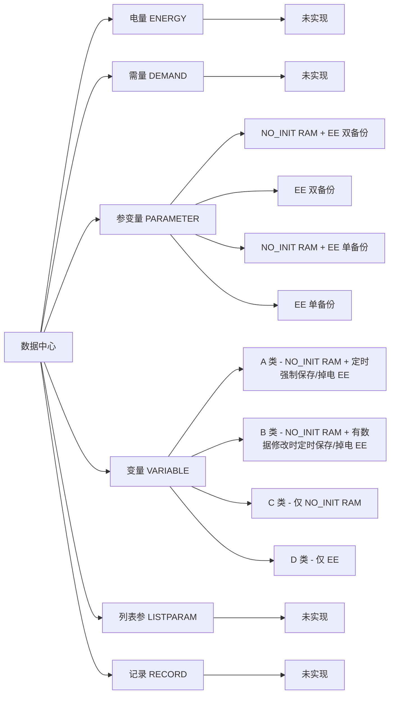

# datacenter 使用说明

## 1. 文档目的

本文档说明电能表数据中心库（`datacenter`）的架构设计、接入方式、配置方法与典型调用流程。

库负责参变量、变量等对象的**别名读写**与**非易失存储边界**。清单、出厂默认、存储驱动、layout 头由产品 **port** 提供；库本身不内嵌某一型表的条目表。

领域用语见仓库根目录 `CONTEXT.md`。单元测试写法见 `test/README.md`。

## 2. 重要约束

`dc/port/` 目录下的文件在本仓库中属于**配置模板**：

| 模板 | 作用 |
|------|------|
| `dc_storage_cfg.h` | 统一编址基址、`DC_NOINIT`、`DcCfgStorageRead` / `Write` |
| `dc_variable_cfg.h` | `VAR_LIST_A/B/C/D`、备份间隔、`VAR_EE_BACKUP_BANKS` |
| `dc_param_cfg.h` | 四段参变量清单、`PARAM_BLOCK_SIZE` / `PARAM_EE_PAGE_SIZE`、出厂默认 |

通过 Git 子模块或拷贝接入时，**不要直接改子模块里的模板原文件**。将 `dc/port/` 拷到产品工程的 port 目录后再适配。

后续升级库时，只对比合并模板差异，避免本地改动被覆盖。

CMake 变量 `DC_PORT_DIR` 指向产品 port（本仓库默认 `dc/test/port`）。编译库与 pack 工具都要把该目录加入 include。**pack 不包含** `dc/port/dc_storage_cfg.h`（避免吃到产品 HAL）；生成的 `dc_*_layout.h` 仍 `#include "dc_storage_cfg.h"`，由固件编译解析产品实现。

生成的 `dc_variable_layout.h` / `dc_param_layout.h` / `dc_alias_layout.h` 写回 `DC_PORT_DIR`，**不入库**。

## 3. 别名入口

### 3.1 为什么用别名分派

电表对象种类多（电量、需量、参变量、变量、列表参、记录），协议层不应直接 `#include` 各存储模块并硬编码偏移。统一入口：

- 调用方只持有 32 位别名与缓冲
- 库按大类分派到已实现的读写函数
- 未实现的大类返回 `DC_RET_UNSUPPORTED` 或 `DC_RET_ALIAS_ERR`

### 3.2 别名编码

```
[31:24] 大类 E_ALIAS_CLASS
[23:8]  小类（类型号）
[7:0]   分项 index（PARAM_INDEX_ALL / VAR_INDEX_ALL = 0xFF 表示整条）
```

构造宏：`ParaAliasBuild` / `VarAliasBuild` 等（`dc_alias.h`）。pack 还生成 `DC_ALIAS_PARAM_*` / `DC_ALIAS_VAR_*`（`dc_alias_layout.h`）。

### 3.3 数据分级

从左到右：**大类 → 存储策略 → 小类**。小类以本仓库测试 port 清单为例；产品以各自 `dc_variable_cfg.h` / `dc_param_cfg.h` 为准。电量、需量、列表参、记录大类尚未实现，无小类。



### 3.4 调用风格

```c
#include "datacenter.h"

uint8_t pucBuf[16];
int16_t ssRet;

ssRet = dc_read_alias(DC_ALIAS_PARAM_UN, pucBuf, 1u, 0u);
if (ssRet < 0) {
    /* DC_RET_ALIAS_ERR / DC_RET_PARAM_ERR / DC_RET_UNSUPPORTED */
}

ssRet = dc_write_alias(DC_ALIAS_PARAM_UN, pucBuf, 1u, 0u);
```

成功返回**实际传输字节数**；`ucType` 保留，传 `0`。

| 大类 | 读 | 写 | 当前状态 |
|------|----|----|----------|
| `ALIAS_CLASS_PARAMETER` | `dc_read_param` | `dc_write_param` | 已实现 |
| `ALIAS_CLASS_VARIABLE` | `dc_read_variable` | `dc_write_variable` | 已实现 |
| `ALIAS_CLASS_ENERGY` | `dc_read_energy` | — | 未实现 |
| `ALIAS_CLASS_DEMAND` | `dc_read_demand` | `dc_write_demand` | 未实现 |
| `ALIAS_CLASS_LISTPARAM` | `dc_read_list` | `dc_write_list` | 未实现 |
| `ALIAS_CLASS_RECORD` | `dc_read_record` | `dc_write_record` | 未实现 |

### 3.5 引入前后对比

| 方面 | 分散直访 | 别名入口 |
|------|----------|----------|
| 模块依赖 | 协议层 `#include` 各存储头、手写偏移 | 只 `#include "datacenter.h"` |
| 清单变更 | 改调用点 | 改 port 清单，pack 重生 layout |
| 存储策略 | 散落在业务里 | 集中在 `dc_param.c` / `dc_variable.c` |

## 4. 库设计

库不跑主循环、不发布事件。产品在上电、周期任务、掉电路径里调用本库。

```
协议 / 业务
    │  dc_read_alias / dc_write_alias
    ▼
dc_alias.c  按大类分派
    ├─ dc_param.c      参变量块 CRC、SRAM 头尾、EE 主槽/备份
    ├─ dc_variable.c   A/B/C/D、魔数、定时/掉电备份
    └─ energy/demand/list/record  占位
    │
    ▼
DC_STORAGE_READ / DC_STORAGE_WRITE  →  产品 DcCfgStorage*
```

### 4.1 变量类（A/B/C/D）

清单：`dc_variable_cfg.h` 的 `VAR_LIST_A/B/C/D`。布局：`dc_variable_pack` → `dc_variable_layout.h`。

SRAM 合成一块（`DC_NOINIT`）：A/B 各带头尾魔数 + body CRC16-CCITT；C 仅 body。

| 类 | 工作区 | 非易失 |
|----|--------|--------|
| A | SRAM body_a | EE：PWR_ON（1 或 2 bank）+ PWR_DWN |
| B | SRAM body_b | 同上（独立槽位） |
| C | 仅 SRAM body_c | 无 |
| D | 无 RAM 镜像 | 仅 EE，直读直写 |

**上电**（首次访问 `var_ensure_init`）：body CRC 好则不读 EE，必要时只补魔数；CRC 坏则 PWR_DWN → PWR_ON_0 → PWR_ON_1。

**运行中访问前**：魔数好则直接访问；否则查 CRC。CRC 坏从 PWR_ON 备份恢复（不用掉电区）；CRC 好只补魔数；恢复失败返回 `DC_RET_PARAM_ERR`。

**写 EE**：产品周期调用 `var_backup_tick(经过秒数)`；掉电调用 `var_backup_power_down()`。A 按间隔备份；B 脏标记 + 间隔；掉电槽按间隔或显式掉电写入。魔数与 CRC 都坏则跳过写盘。

### 4.2 参变量

清单：`dc_param_cfg.h` 四段宏固定顺序（RAM+EE 双备份 → EE 双备份 → RAM+EE 单备份 → EE 单备份）。布局：`dc_param_pack` → `dc_param_layout.h`。

一块 = `PARAM_BLOCK_SIZE`（含 2 字节块尾 CRC）。带 RAM 的块放进同一个 `ST_PARAM_SRAM`（头标记 + 各紧凑块 + 尾标记），`DC_NOINIT`。没有 RAM 的块用 scratch，上电不扫。

| 宏 | 工作区 | EE |
|----|--------|-----|
| `PARAM_STORE_RAM_EE_BK` | 共用 SRAM 信封 | 主槽 + 备份区 2 |
| `PARAM_STORE_EE_BK` | 无（scratch） | 主槽 + 备份区 2 |
| `PARAM_STORE_RAM_EE` | 共用 SRAM 信封 | 仅主槽 |
| `PARAM_STORE_EE` | 无（scratch） | 仅主槽 |

备份区 2 **不进** `tParamBlockTable`：`PARAM_EEPROM_ORIGIN + PARAM_EE_BAK_BASE + ulBlockEeOff`。

**上电**：每个带 RAM 的块先查块尾 CRC（头尾对也不能跳过）。坏则主槽 → 备份 → 出厂默认。各块 CRC 都好且头尾坏才补头尾。恢复与填默认**不写** EE。

**运行中**：头尾都对则信 RAM，不再查块 CRC；头或尾不对再按块恢复并补头尾。无 RAM 块在每次读写时装 scratch。

**落盘**：仅 `dc_write_*`：刷新当前块 CRC 后写主槽；有 BAK 再写备份区 2。

数据类型：INT / ARRAY / STRUCT / LIST / LINKARRAY（跨连续块、按记录分页）。

### 4.3 产品侧周期与掉电

| 时机 | 调用 |
|------|------|
| 上电后第一次读写 | 别名读写即可触发 init，无需单独 Init API |
| 秒级任务 | `var_backup_tick(距上次秒数)` |
| 掉电保存 | `var_backup_power_down()`，再停存储驱动 |

## 5. 目录结构与职责

| 路径 | 作用 |
|------|------|
| `inc/` | 公共 API：`datacenter.h`、`dc_alias.h`、`dc_param.h`、`dc_variable.h` |
| `src/` | 固件实现（`*.c` 由 CMake 自动收集） |
| `port/` | 产品 port **模板**（拷走后改） |
| `tools/` | host pack：由 cfg 生成 `dc_*_layout.h` 并 upsert `dc_layout.md`（详见第 6 节） |
| `test/` | Google Test case、`test/port` 测试用移植文件 |
| `test/port/dc_*_layout.h` | 构建生成，不入库 |
| `test/port/dc_layout.md` | pack 同步的分类消耗与条目表 |

库 **不包含**：参变量/变量清单、出厂默认、layout 头、storage 驱动、条目宽度常量。

## 6. tools 目录用法

`dc/tools` 是 **host 侧布局生成器**，不链入固件。根据产品 port 里的 `dc_variable_cfg.h` / `dc_param_cfg.h` 生成：

| 工具 | 读入 | 写出 |
|------|------|------|
| `dc_variable_pack` | `VAR_LIST_A/B/C/D` | `dc_variable_layout.h`；upsert `dc_layout.md` 变量段 |
| `dc_param_pack` | `PARAM_ITEM_LIST_*`、默认值宏 | `dc_param_layout.h`；upsert 参变量段 |
| `dc_alias_pack` | 变量 + 参变量清单 | `dc_alias_layout.h`（`E_DC_ALIAS`） |

pack **只包含** port 的清单 cfg 与 `dc/inc`，**不包含** 产品 `dc_storage_cfg.h`。内容与已有文件相同则不改时间戳。`--dump` 只打印到 stdout，不写文件。

改清单后必须重新跑 pack；不要手改 `*_layout.h`。生成顺序：`dc_variable_layout` → `dc_param_layout` → `dc_alias_layout`（`gen_layouts` 一次做完）。

### 6.1 独立工程（推荐产品 / CI）

`dc/tools/CMakeLists.txt` 与固件库分离：

```text
cmake -S dc/tools -B dc/tools/build -DDC_PORT_DIR=<产品port>
cmake --build dc/tools/build --target gen_layouts
```

未指定 `DC_PORT_DIR` 且存在 `dc/test/port/dc_variable_cfg.h` 时，默认用测试 port。port 必须同时有 `dc_variable_cfg.h` 与 `dc_param_cfg.h`。

常用目标：

| 目标 | 作用 |
|------|------|
| `gen_layouts` | 生成三份 layout 头 |
| `dc_variable_layout` / `dc_param_layout` / `dc_alias_layout` | 只跑对应 pack |
| `dc_variable_dump` / `dc_param_dump` | `--dump` 到 stdout |

Windows 也可：

```text
dc\tools\gen_layouts.cmd [PORT_DIR]
```

- 参数 `PORT_DIR` 优先于环境变量 `DC_PORT_DIR`；都省略则用 `dc/test/port`。
- `DC_TOOLS_BUILD` 指定 CMake 构建目录，默认 `dc/tools/build`。
- 首次配置时若 PATH 里有 `mingw32-make` 则用 MinGW；否则尝试 Ninja。

手工调用可执行文件（路径以构建目录为准）：

```text
dc_variable_pack [--dump] <dc_variable_layout.h>
dc_param_pack    [--dump] <dc_param_layout.h>
dc_alias_pack    <dc_alias_layout.h>
```

### 6.2 随 `dc/` 库一起编

`dc/CMakeLists.txt` 同样编译三个 pack。`dc_variable_layout` / `dc_param_layout` / `dc_alias_layout` 默认挂在 `ALL` 上，编库或 `dc_tests` 就会写 `DC_PORT_DIR`（本仓库默认 `dc/test/port`）。单独 dump：

```text
cmake -S dc -B dc/build-ninja -G Ninja
cmake --build dc/build-ninja --target dc_param_dump
```

一次生成三份头请用 `dc/tools` 的 `gen_layouts`（见 6.1）；库工程没有同名目标。

`dc_layout.md` 与 layout 头同目录；各 pack 用 HTML 注释标记自己的段，互不覆盖。

## 7. 接入步骤

1. 将本库加入工程（子模块或拷贝 `dc/`）。
2. 把 `dc/port/` 拷到产品 port 目录，实现：
   - `DcCfgStorageRead` / `DcCfgStorageWrite`
   - `DC_NOINIT`（如 IAR `__no_init`）
   - `VAR_LIST_*`、`PARAM_ITEM_LIST_*`、默认值宏
3. 配置 `DC_PORT_DIR` 为该目录。
4. 构建 pack，生成 layout 头（第 6 节）。固件 include 路径需含 `dc/inc` 与 `DC_PORT_DIR`。
5. 链接 `datacenter`；业务只调用 `dc_read_alias` / `dc_write_alias` 与变量备份两个函数。
6. 在秒任务、掉电路径挂上 `var_backup_tick` / `var_backup_power_down`。

独立生成 layout 见第 6 节。本仓库自测：

```text
cmake -S dc -B dc/build-ninja -G Ninja
cmake --build dc/build-ninja --target dc_tests
```

`dc_tests` 收集 `test/*_test.cpp`。

## 8. 配置说明

### 8.1 存储钩子（必须）

在产品 `dc_storage_cfg.h` 中实现（或同目录 `.c`）：

| 符号 | 时机 | 说明 |
|------|------|------|
| `DcCfgStorageRead` | 恢复、D 类读、EE-only 读 | 按统一绝对地址读；成功返回长度 |
| `DcCfgStorageWrite` | 参变量写、变量备份 | 成功返回长度；失败则库返回 `DC_RET_PARAM_ERR` |
| `DC_NOINIT` | SRAM 对象定义 | 复位不清零；host 测试可为空 |
| `VAR_EEPROM_BASE` / `PARAM_EEPROM_BASE` | 编址 | 默认 EE 基址上变量区在前、参变量在后 |

统一空间：`DC_STORAGE_BASE_EE` → `FLASH` → `FILE`，产品在 Read/Write 里按区间分发。

### 8.2 变量清单

`dc_variable_cfg.h`：

- `VAR_EE_BACKUP_BANKS`：`1` 或 `2`
- `VAR_A_BACKUP_INTERVAL_SEC` / `VAR_B_BACKUP_INTERVAL_SEC` / `VAR_PWR_DWN_INTERVAL_SEC`
- `VAR_LIST_A/B/C/D(X)`：`X(名字, 元素个数, 单元素字节)`

### 8.3 参变量清单

`dc_param_cfg.h` 用四段 `*_ROWS` 拼 `PARAM_ITEM_LIST`，顺序即小类 ID 与装箱顺序。行宏见 `dc_param_cfg_macros.h`（`PARAM_INT` / `PARAM_ARRAY` / `PARAM_STRUCT` / `PARAM_LIST` / `PARAM_LINKARRAY` 等）。

约束：

- `PARAM_EE_PAGE_SIZE` 必须是 `PARAM_BLOCK_SIZE` 的整数倍
- 存储特性不同的条目不得同块（pack 按 flags 变化或放不下则新开块）
- 链接数组占用连续独占块；单条记录不得超过一块有效载荷

出厂默认：`PARAM_ITEM_DEFAULTS`；无默认则工作区填 `0xFF`，上电填默认不写 EE。

### 8.4 查看布局

```text
cmake --build <build> --target dc_param_dump
```

或看 `DC_PORT_DIR/dc_layout.md`：各类 RAM、相对 EE 起止、参变量 `reserve`（`blk_size − compact`）。

## 9. 注意事项

1. **不要改库内 `dc/port/` 当产品配置用**；只改拷贝后的 port。
2. **不要手工维护 layout 头**；改清单后必须跑 pack。
3. **不要在 `dc_param.c` / `dc_variable.c` 里写表计业务**；协议与应用只走别名。
4. **首次读写即 init**；不要假定未访问前 RAM/EE 已对齐。
5. **上电恢复不写 EE**；只有 `dc_write_*` 和变量备份函数落盘。
6. **产品必须定义 `DC_NOINIT`**，否则复位会清掉 A/B 与参变量 SRAM 信封。
7. **`var_backup_tick` 的实参是经过秒数**，不是绝对时间。
8. **写失败会返回错误**；B 类脏标记仅在备份成功后清除。
9. 电量 / 需量 / 列表参 / 记录大类尚未实现，调用会失败。
10. 单元测试必须写 `// 测试内容：` 与编号步骤，见 `test/README.md`。
